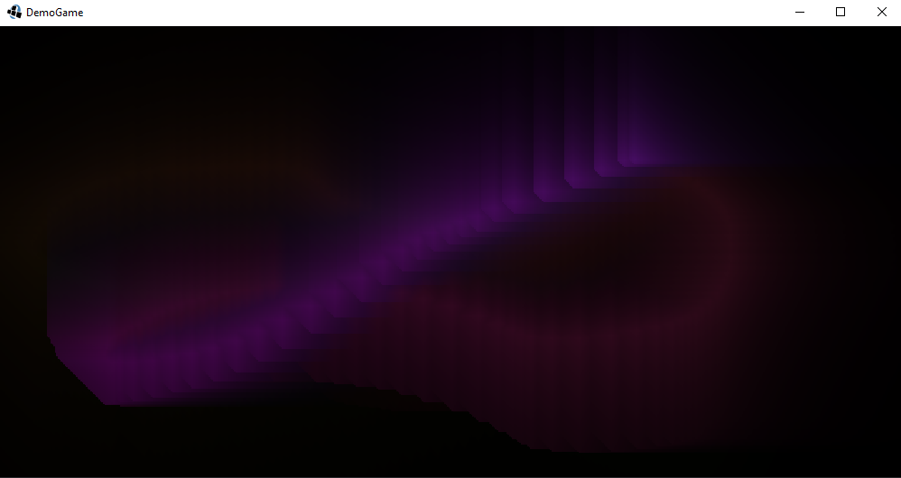

# Demo Libgdx Scala App

This is a basic demo project for using libgdx with scala.

It uses some basic features:
* Input from the mouse
* Rendering using the shape renderer

# Instructions

In a terminal:

`sbt run`

# Screenshot

